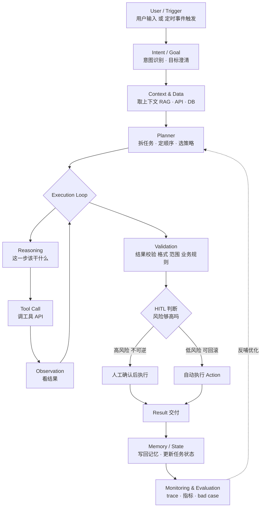

# 第 01 关 · Architecture —— 一个 Agent 到底怎么跑

> 六关连载的第一关。这一关是**其余五关的目录**：
> 被问到任何 Agent 设计题，先在脑子里过这张图，就不会漏环节。

---

## 图



**外围还有一圈**，包住整张图、不属于其中任何一个格子：

> **权限 · Guardrail · Retry · Timeout · Fallback · Cost 上限 · Logging · Observability**

---

## 三句话讲清

**1. 主干是一条链**

```
触发 → 定目标 → 取上下文 → 规划 → 执行循环 → 校验
     → 决定自动还是人工 → 交付 → 记忆与状态 → 监控评测
```

**2. 只有中间那一段是循环**

`Reasoning → Tool Call → Observation` 是回路，前后都是单向流水。
**这是 Agent 和 Workflow 唯一的结构性差别**——工作流每一步是人定死的，Agent 在这个循环里由模型决定下一步做什么。

所以判断"这东西算不算 Agent"，只看一件事：**有没有那个循环，以及循环里的下一步是谁决定的。**

**3. 横切关注点包住整张图，不在某个格子里**

权限、重试、超时、成本上限、日志——这些不是流程里的一个节点，是每个节点都要有的东西。
很多人画 Agent 架构图只画主干，然后被问"那超时怎么办"就卡住了。

---

## 母案例：SEO Agent 里长什么样

> 场景：一个站点有几千个页面，需要定期找出流量下滑的页面、诊断原因、给优化方案。
> 这是我熟的业务，所以坑是真的。

| 环节 | SEO Agent 的具体形态 |
|---|---|
| **Trigger** | 运营手动发起，或**每周定时**跑一次站点体检 |
| **Intent / Goal** | 「找出流量下滑的页面并给优化方案」—— 目标要能落成可验证的指标 |
| **Context & Data** | GSC API（曝光 / 点击 / CTR / 排名）+ 页面内容 + **CTR Benchmark**（同位次基准）+ 历史优化记录 |
| **Planner** | 拆成六阶段：取数 → 异常页面识别 → 逐页诊断 → 归因分类 → 生成建议 → 批量执行 |
| **Execution Loop** | **只在「逐页诊断」这一步循环**：看指标 → 调工具查（内容 / 技术 / 竞品）→ 看结果 → 决定还要不要继续查 |
| **Validation** | 建议是否可执行、字段长度是否合规（title / meta 有长度限制）、有没有改到不该改的字段 |
| **HITL** | 改 meta = 建议后人工拍板；**改 canonical / robots / 删页面 = 禁止 Agent 自主执行** |
| **Action** | 通过 CMS API 批量写入 |
| **Memory / State** | 已诊断页面清单 + benchmark 缓存 + **历史「哪类改动真的带来提升」的经验沉淀** |
| **Monitoring** | 每页成本与耗时、诊断准确率、建议采纳率、改完之后的真实流量变化 |

### 这个案例里最值得注意的一行

**Execution Loop 只包住「逐页诊断」。**

其余五个阶段（取数、找异常页、归因、给建议、批量执行）路径是固定的，用确定性流程更稳更省。
只有"这个页面到底为什么流量掉了"这一步，**我事先不知道答案在哪**——可能是 title 写得差导致点击率低，可能是内容不匹配搜索意图，也可能是技术层面被 canonical 指错了。这一步才需要模型临场判断。

> 这就是第 02 关（Planning）要展开的东西：**先问"要不要 Agent"，再谈怎么设计。**

---

## 这张图能回答哪些问题

- **「设计一个 XX Agent」** → 照这张图报框架，再用业务细节填空。**开口第一句先说"我把它拆成 N 步"**，别一上来就讲名词。
- **「画一个生产级 Agent Architecture」** → 就是这张图 + 外围那一圈。主动补横切关注点这句。
- **「Agent 和 Workflow 有什么区别」** → 只有那个执行循环，且循环里下一步由模型决定。

## 取舍怎么讲

> 「我这里之所以把 **Validation 单独设成一层**、而不是信任模型自己检查，是因为**模型的自查和它的生成来自同一个分布**——它错的时候往往也觉得自己对。校验必须由外部规则或另一个模型来做。」

这类句子是设计题的分水岭：**不是描述你做了什么，是说明你为什么不选另一条路。**

---

## 一句话记忆点

> **循环只包住不确定的那一段。**

---

← [返回六关目录](README.md) ｜ 下一关：02 · Planning（连载中）
